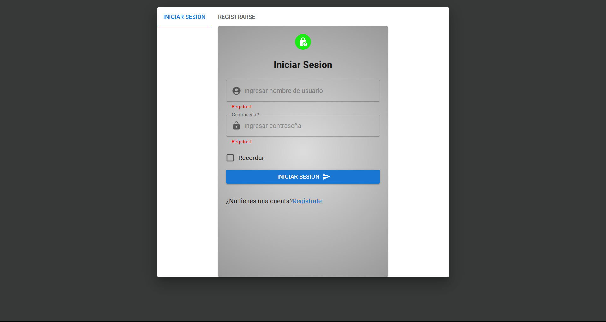
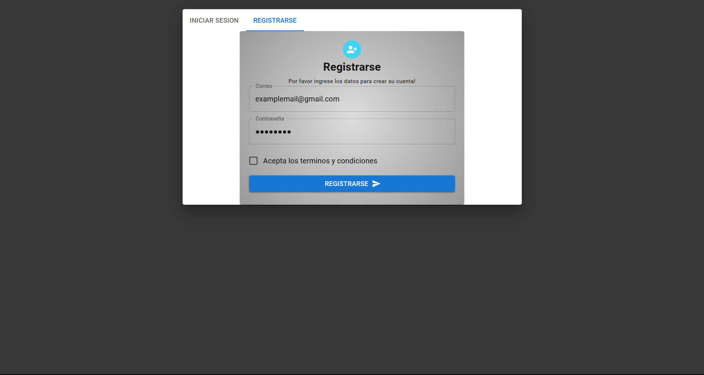
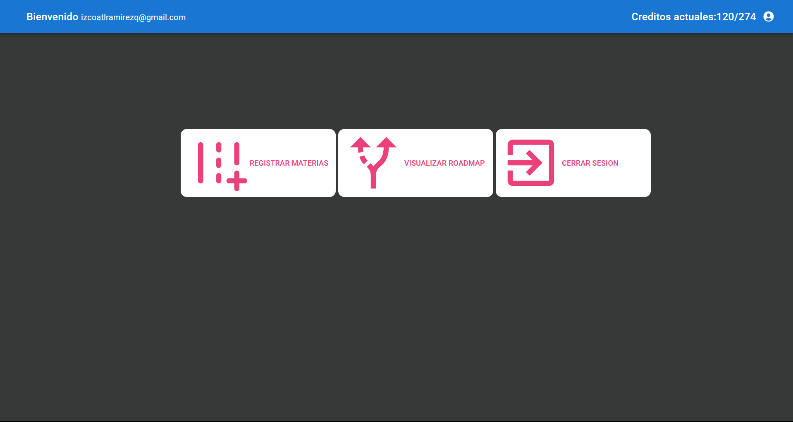
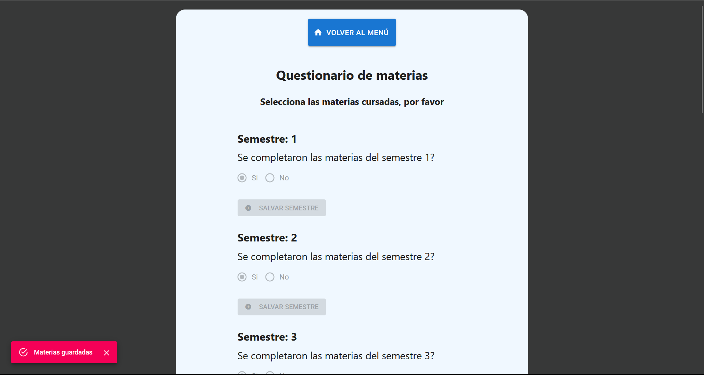
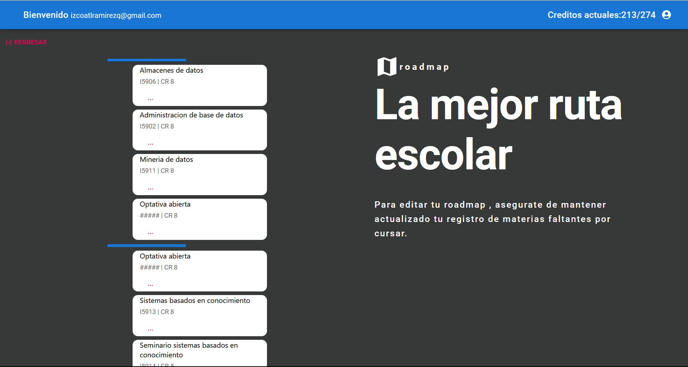
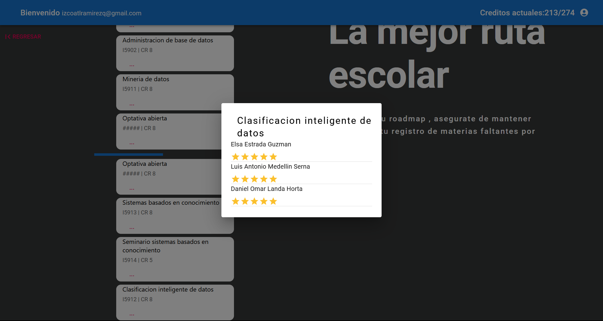

# roadmapp
Esta aplicacion fue creada usando Postgresql, Express , React y Node.

Aplicacion web donde los estudiantes de informatica de udg pueden registrar sus materias 
faltantes por cursar y obtendran un roadmap personalizado, guiandolos en un mejor camino durante la carrera, 
ayudandolos a evitar materias que aun no deberian tomar, y en cantidades que no deberian tomar , logrando tener un flujo 
de trabajo mas equilibrado , ademas de proporcionar recomendaciones de los mejores profesores para cada materia.

Registro e inicio de sesion de usuarios:

Dentro del menu puedes elegir registrar materias, visualizar roadmap , o salir:

Puedes registrar tus materias y elegir en cuantos semestres deseas cursar aquellas materias que haz elegido,
esto se tomara en cuenta en la creacion del roadmap. Cada vez que registres materias ,tu roadmap se actualizara
,asi como los creditos actuales del estudiante.

Al visualizar tu roadmap podras ver el orden en que deberias cursar las materias faltantes y cuales deberias agendar por
semestre ,separados por la barra azul.

Al clickear en alguna materia podras ver los profesores mas recomendados para cursar la misma.

